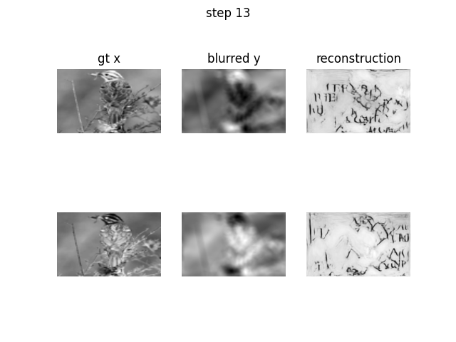

# hdc2021_LGD (In Progress)
Our submission for the HDC2021. 

## Install 

Install the package using:

```
pip install -e .
```
Make sure to have git-lfs installed to pull the weight files for the model.

## Usage 

Prediction on images in a folder can be done using:

```
python deblurrer/main.py path-to-input-files path-to-output-files step
```

## Method

We want to reconstruct the original image $f \in X$ from blurred and noisy data $g_\eta \in X$. The forward operator is given by $\mathcal{A}: X \rightarrow X$. This corresponds to an inverse problem: 
$$ g_\eta = \mathcal{A} f + \eta $$

Our goal is to define an reconstructor $\mathcal{R}_\Theta : X \rightarrow X$ which produces an unblurred image from the blurred $g_\eta$:

$$ f \approx \mathcal{R}_\Theta (g_\eta)$$


Our approach is inspired by the recent trend of combining physical forward models  and learned iterative schemes [(Adler et. al.)](https://arxiv.org/abs/1704.04058). There is also experimental evidence that this approach can work well even with an approximated forward model [(Hauptmann et. al.)](https://arxiv.org/abs/1807.03191).
This approach has two steps:
1. First, we define an approximate forward model for the blurring process.
2. This approximate model is integrated into a learned gradient descent scheme.  

This approach is repeated for every step. The same training setup and neural network architecture was used for all blurring steps. The learned gradient scheme was retrained on each blurring step. 

### Approximate Forward Model 

For a fixed blurring level the out-of-focus blur can be modeled by as a linear, position invariant convolution with a circular point-spread-function: 

$$ g_\eta = \mathcal{A} f + \eta = k * f + \eta $$

with 

$$ k(x) =  \left\{\begin{array}{lr}
        \frac{1}{\pi r^2}, & \text{for } \| x \|^2 \le r^2\\
        0, & \text{else }
        \end{array}\right\} $$

This model works well for small blurring levels. For higher blurring levels the average error between the approximate model and the real measurements gets bigger. 

### Learned Gradient Descent

Variational methods try to recover the original image as the minimizer of an objective function 

$$ \hat{f} = \mathcal{R}_\Theta(g\eta) \in \argmin_f d(\mathcal{A}f, g_\eta) + \lambda R(f) $$

where $d:X\times X \rightarrow \mathbb{R}$ is a data fidelity term and $R:X \rightarrow \mathbb{R}$ is a regularizer. In many examples, the regularizer is convex but not differentiable (e.g. TV or l1). In these cases proximal gradient descent can be used to obtain the minimizer: 

$$ f_{k+1} = \text{prox}_{\lambda R}(f_k - \gamma \nabla d(\mathcal{A}f_k, g_\eta)) $$

with a step size $\gamma > 0$. The idea of learned iterative methods is to unroll this iteration for a fixed number of steps and replace the proximal mapping with a convolutional neural network: 

$$ f_{k+1} = \Lambda_{\theta_k}(f_k, \nabla d(\mathcal{A}f_k, g_\eta)) \qquad \text{ for } k=0,\dots, K-1 $$

We use the $K$-th iterate as the final reconstruction $\mathcal{R}_\Theta(g_\eta) = f_K$. The mappings $\Lambda_{\theta_k}: X \times X \rightarrow X$ are implemted as convolutional UNets. The parameter $\Theta$ includes all parameters of all subnetworks, i.e. $\Theta = (\theta_0, \dots)$. We split the provided data into a training, validation and test part. We train our learned iterative method by minimizing the mean squared error between the reconstruction and the groundtruth model on the training set:

$$ \hat{\Theta} \in \argmin_\Theta \frac{1}{n} \sum_{i=1}^n \| \mathcal{R}_\Theta(g_\eta) - f \|_2^2  $$

Here, the mean square error served us as a proxy for the real goal: high accuracy for character recognition.

### Sanity Check

We tried our own sanity check on images from the [STL10 dataset](https://cs.stanford.edu/~acoates/stl10/). STL10 is an image reconginition dataset consisting of natural images of 10 different classes. We used our approximate forward model to simulate a blurred version of STL10. We evaluated our learned iterative model on this blurred natural images. 



*Figure: Sanity Check on intial model fails.*

It was clear, that our initial model would not pass the sanity check.

Due to the sanity check, we have a kind of constrained optimization problem. Maximize the OCR accuracy under the constraint that we have a slight beblurring effect on natural images. In order to tackle this problem, we used a combined training of the provided challenge data with STL10 images. For every training step we checked if the PSNR between the reconstruction $\mathcal{R}(g_{STL10})$ and the unblurred image $f_{STL10}$ was lower than the PSNR btween the blurred image $g_{STL10}$ and the unblurred image $f_{STL10}$. If our reconstruction was more than $2$dB lower in terms of PSNR than the blurred image we added one STL10 image to the current training batch. 


## Examples

## Requirements 

* numpy = 1.20.3
* pytorch = 1.9.0 
* pytorch-lightning = 1.3.8
* torchvision = 0.10.0

## Authors

Team University of Bremen, Center of Industrial Mathematics (ZeTeM): 
- Alexander Denker, Maximillian Schmidt, Johannes Leuschner, Sören Dittmer, Judith Nickel, Clemens Arndt, Gael Rigaud, Richard Schmähl